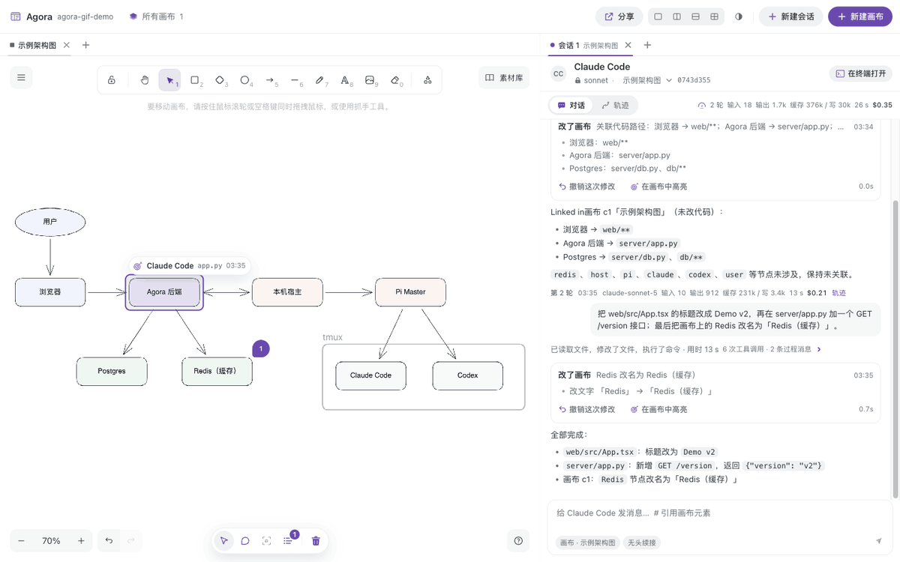
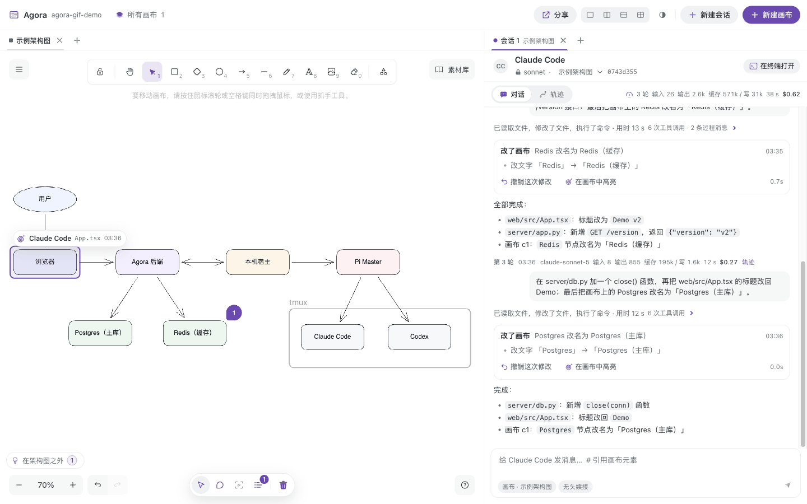
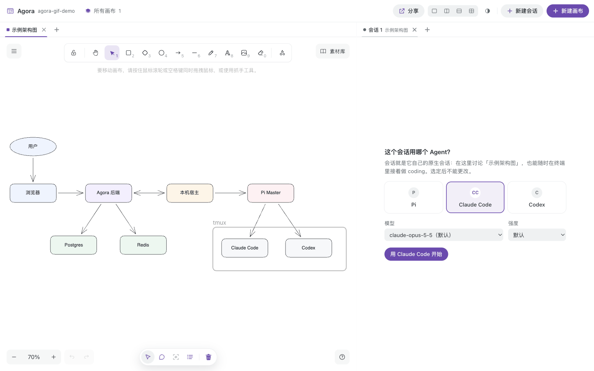
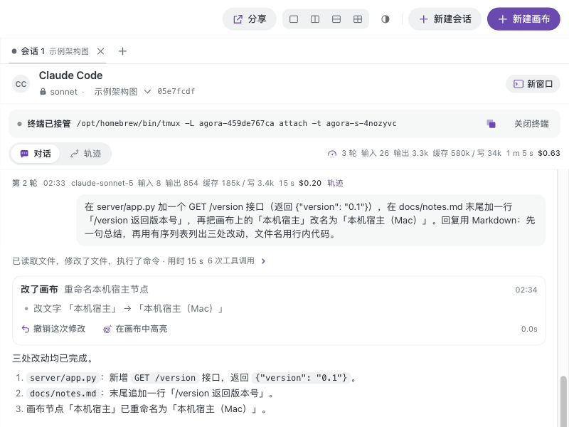
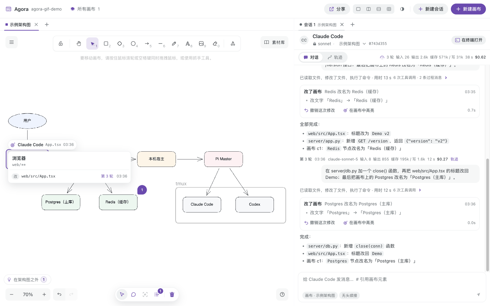
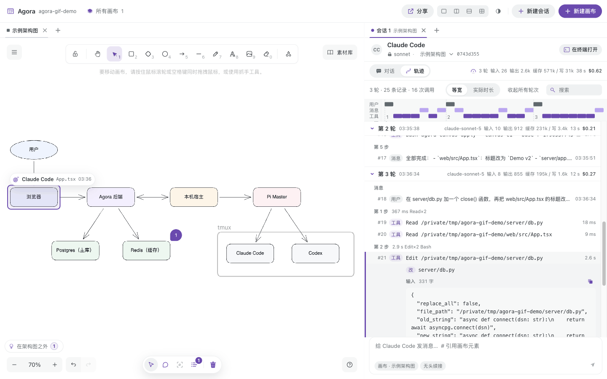
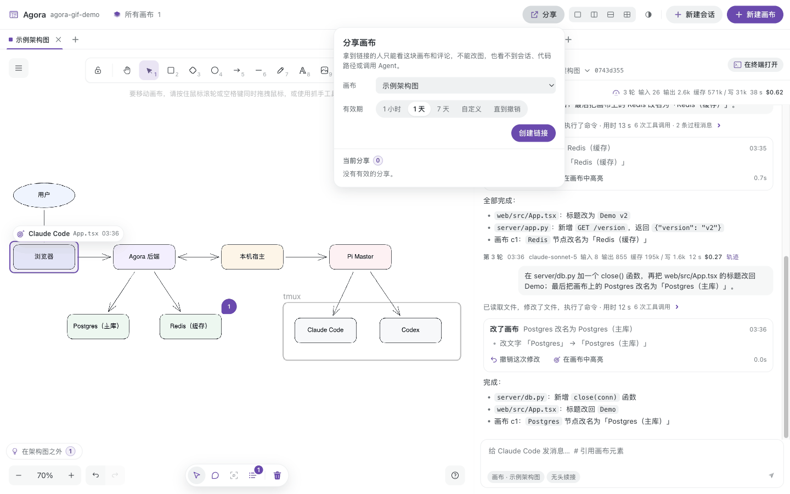
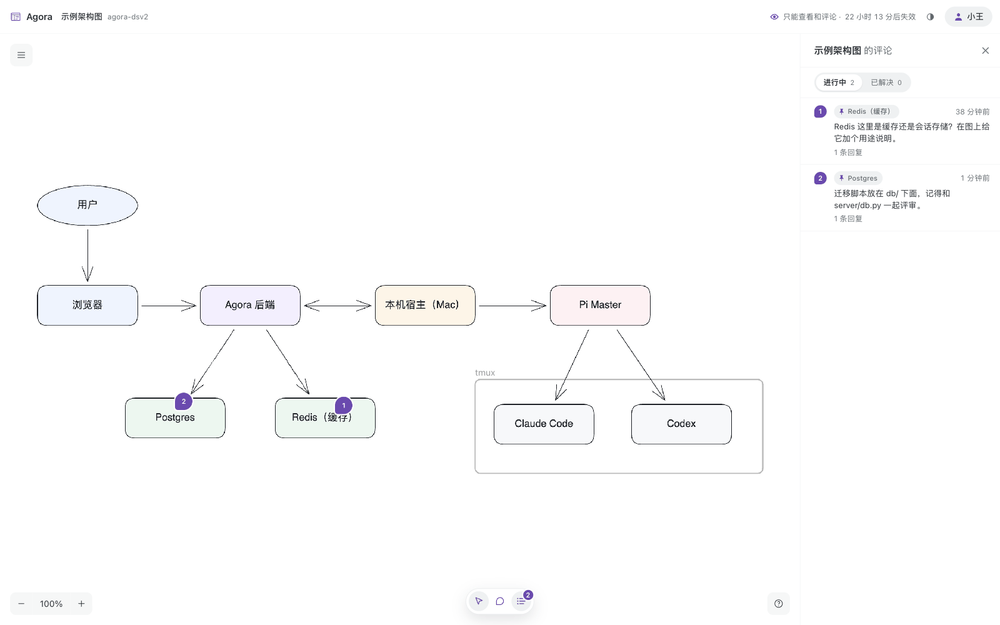
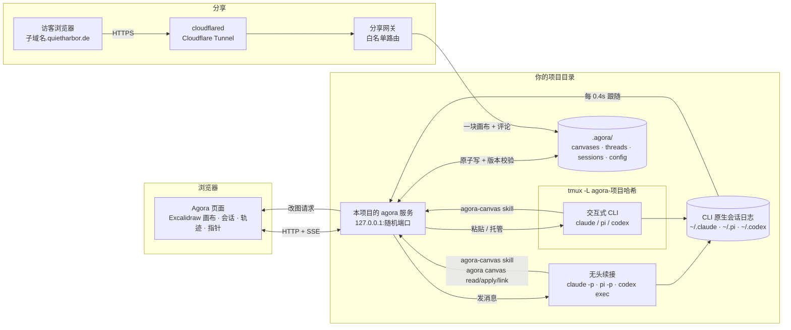

# Agora

**每个项目自带一个 Agora：在项目的架构图上，和你自己选的 coding agent 讨论设计，再一键回到终端接着写代码。**

*A per-project architecture canvas where you and your own coding agent (Pi, Claude Code or Codex) discuss the design, then continue the very same session in the terminal.*



在项目目录里运行 `agora up`，就得到只属于这个项目的本地服务：架构图、评论、会话记录都存在项目的 `.agora/` 里，跟着代码一起提交、克隆、切分支。

## 为什么

- **架构讨论和开发是脱节的。** 图画在白板工具里，代码写在终端里，讨论完的结论要靠人搬运。
- **Agent 不记得项目是怎么定的。** 每次开新会话都要重新解释模块怎么分、为什么这么分。
- **Agent 的改动不可见。** 它改了哪些文件、落在架构的哪一块、有没有改到计划之外，只能事后翻 diff。

Agora 把这三件事放到同一张图上：图就在仓库里，agent 能读能改；它写代码时，图上的指针告诉你它正在动哪一块。

## 核心能力

### 1. 一个项目一个 Agora，数据跟着代码走

`agora up` 在当前目录初始化 `.agora/` 并起本项目专属服务（只监听 `127.0.0.1`，不同项目各占一个端口）。画布是标准 `.excalidraw` 文件，评论是 JSON，键排序、内容不变就不重写，git diff 可读。会话记录、运行状态和分享记录默认不提交。格式见[项目存储](web/docs/project-storage.md)。



### 2. 你自己的 coding agent，平级、会话锁定

每个会话开始时从 **Pi / Claude Code / Codex** 里选一个，连同模型和强度一起锁定。会话就是这个 CLI 自己的原生会话，Agora 不另存对话，而是跟随 CLI 的会话日志。agent 通过 `agora-canvas` skill 调 `agora canvas read / apply / link / anim` 读图、改图，每次改图都是一批可撤销的修改。画布上的评论可以直接「交给 Agent」，答复会贴回评论线程。见 [Agent 会话](web/docs/agent-sessions.md)。



### 3. 一键在终端继续，双向同步

「在终端打开」用同一个原生会话 id 起交互式 CLI（`claude --resume`、`pi --session-id`、`codex resume`），下拉里选在哪儿打开（记在浏览器里）：**Kitty**——在本项目专属的 tmux 服务器里起，再用 Kitty（没有就 Terminal.app）打开窗口；**Seedmux**——经 Seedmux 官方控制桥在当前标签页旁新开一个 pane，CLI 直接跑在里面。你在终端里说的话、agent 的回复和工具调用都会出现在面板上；从面板发的消息会等 agent 这一轮结束、终端 4 秒没有按键后粘贴进去。



### 4. 进度指针：AI 正在改架构图的哪一块

给节点关联代码路径（glob，存在元素的 `customData.codePaths` 里，随图提交），可以手动设，也可以让 agent 按目录结构批量关联。agent 每写一个文件，图上唯一的指针就滑到这个文件所属的节点；不属于任何节点的文件列在「在架构图之外」。终端里发生的改动同样驱动指针。见[进度指针](web/docs/progress-pointer.md)。



### 5. 轨迹逐步可查

「对话 / 轨迹」两种视图（信息结构取自 DeepSeek Harness）：每轮的模型、强度、输入 / 输出 / 缓存 tokens、耗时、花费；时间轴总览；每次工具调用可展开看完整输入、输出、改到的文件和起止时间。



### 6. 经 quietharbor.de 分享给别人只读评论

`agora share create --for 1d`（或顶栏「分享」）经 Cloudflare Tunnel 给一块画布开一个独立子域名，访客只能看图、读评论、发评论和回复；改图、会话、终端、代码路径和本地路径都不下发。到期或撤销后 DNS 记录和隧道一起删除。域名来自你自己的 Cloudflare zone（作者本机用的是 `quietharbor.de`）。见[分享](web/docs/sharing.md)。

| 作者：选画布和有效期 | 访客：只读画布，可评论 |
|---|---|
|  |  |

## 架构



- 画布由页面持有：`agora canvas apply` 经服务转给最近连接的页面执行（校验 schema、引用和新鲜度），结果写回 `.agora/`。
- 对话以 CLI 自己的会话日志为准；服务跟随日志，把终端和面板两边的轮次都推给页面。
- 分享网关只通到被分享的那一块画布和它的评论；作者自己的应用不在隧道后面。

## 快速开始

依赖：

| 依赖 | 用途 |
|---|---|
| [uv](https://docs.astral.sh/uv/)（Python 3.12+） | 服务和 `agora` 命令 |
| Node 24（写在 `web/mise.toml`，装了 [mise](https://mise.jdx.dev) 会自动选用） | 构建前端 |
| tmux | 「在终端打开」 |
| 至少一个已登录的 agent CLI：`claude`、`pi` 或 `codex` | 会话 |
| 可选：`cloudflared` + 自己的 Cloudflare 域名 | 分享 |

```bash
git clone https://github.com/arvakme/agora.git ~/code/agora
cd ~/code/agora
uv sync
cd web && npm ci && npm run build && cd ..      # 用 mise 时：mise exec -- npm ci，以此类推

cd ~/code/my-service                            # 你的项目
~/code/agora/bin/agora open                     # 初始化 .agora/，起本项目服务并打开浏览器
~/code/agora/bin/agora status                   # 在跑就打印地址、端口、pid
~/code/agora/bin/agora down                     # 停掉服务和本项目的 tmux
~/code/agora/bin/agora doctor [--fix]           # 检查本机数据；--fix 从备份和本机注册表放回丢了的东西
```

- 删除的画布和会话进「回收站」，30 天内可恢复（刷新、重启后也行）；「所有画布」底部还有「会话历史」，可以按时间、agent、主题、画布找会话，也能把本机找到的原生会话重新导入。
- 仓库移动、`cp -r` 复制、重新 clone 都有处理：移动后 Pi 会话的日志跟着挪；副本里的会话只读、可分叉继续；别的机器建的会话显示成只读卡片。`git clean -fdx` 删掉的本机数据（会话绑定、改图记录、回收站）由仓库外的每日备份和本机注册表兜底：`agora doctor --fix`。见[项目存储](web/docs/project-storage.md)。

- 首次打开会建一块「示例架构图」和一个会话；在会话里选好 agent 就可以开始讨论。
- 绑定会话时会自动为该 agent 安装 `agora-canvas` skill；也可以手动 `agora skill install --agent claude|codex|pi|all`（Claude Code 链接到 `.claude/skills/`，Codex 链接到 `.agents/skills/`，Pi 每次启动带 `--skill`；链接写进 `.git/info/exclude`，不改全局配置）。
- 把 `~/code/agora/bin` 加进 `PATH` 后可以直接用 `agora up` / `agora open`。`agora up` 只起服务并打印地址；`agora open --dev` 走 vite 热更新，开发 Agora 本身时用。

分享需要 `cloudflared`，并已 `cloudflared tunnel login`（或设置 `AGORA_CF_API_TOKEN` + `AGORA_CF_ZONE_ID`；`AGORA_SHARE_DOMAIN` 可指定域名）：

```bash
agora share create --for 1d        # 默认分享聚焦的画布；--canvas <id|名字>；--for 10m|2h|1d|7d|forever
agora share list
agora share revoke <id>            # 或 --all
```

## 评测

固定的 7 类改图任务，每类跑 3 次，逐次检查：通过 schema 校验、新鲜度、改对元素、没有误伤、撤销后完全还原。最近一次（2026-09-28，`claude-sonnet-5`）：

| 任务 | 通过 | 平均耗时 | 平均花费 |
|---|---|---|---|
| T1 改名 | 3/3 | 5.7 s | $0.0088 |
| T2 新增节点并连线 | 3/3 | 8.7 s | $0.0092 |
| T3 给箭头加标签 | 3/3 | 4.6 s | $0.0039 |
| T4 对齐两个节点 | 3/3 | 26.2 s | $0.0232 |
| T5 删除节点并重连 | 3/3 | 4.8 s | $0.0050 |
| T6 从素材库插入 Kafka | 3/3 | 18.9 s | $0.0213 |
| T7 画一个普通 TODO 方框 | 3/3 | 6.3 s | $0.0057 |
| **合计** | **21/21（100%）** | **10.7 s** | **$0.0110（总 $0.2312）** |

评测基线是一次性的 `claude -p --json-schema`，在**中性的空临时目录**里运行，不继承仓库或项目上下文，也不经过 Agent 会话，只衡量「看图 + 评论 → 类型化改图操作」这一步。明细见 [web/eval/latest-report.md](web/eval/latest-report.md)，原始记录在 `web/eval/runs/`。

```bash
cd web
npm run eval -- --runs 3     # 真模型，写 eval/runs/*.jsonl 与 eval/latest-report.md
npm run eval:replay          # 离线回放最近一轮的模型输出（validate → apply → check → undo），不调模型
```

## 项目结构

```
agora_cli/            agora 命令：init / up / open / status / down / canvas / skill / share
bin/agora             在任意项目目录里调用上面的命令（uv run --project <仓库>）
server/canvas/        本项目服务：项目存储、三个 agent 后端、会话跟随与终端、画布桥接、分享与网关
skills/agora-canvas/  给 Pi / Claude Code / Codex 的 skill（读图、改图、关联代码、动画）
web/                  前端（React + Excalidraw）；web/docs/ 是各功能规格，web/eval/ 是评测
web/libraries/        vendored 素材库（约 6k 个组件，来源与许可见其 NOTICE.md）
tests/                Python 测试
docs/                 开发协作与测试说明；docs/legacy-rooms.md 是早期房间调度的说明
server/ brain/ daemon/ host/ agora_ask/ k8s/
                      早期「多 Agent 房间调度」实现（Postgres + Redis），已不是当前产品路径
```

## 限制

- **单人编辑。** 没有实时多人协同。同一项目开多个窗口，或在编辑器 / git 里改了 `.agora/` 文件，靠版本校验发现冲突，由你选择载入磁盘版本或覆盖；外部改动不会主动推送到已打开的页面。
- **写图需要打开的页面。** 改图、关联代码、动画都由页面执行；只开终端、没开页面时 `agora canvas apply` 返回退出码 3。
- **访客只能评论。** 不能改图、不能标记解决、不能交给 Agent。分享依赖你自己的 Cloudflare 账号和域名；刚删掉的子域名在别人的 DNS 缓存里可能还会留几分钟（返回 530）。
- **终端里仍能换模型。** 锁定只管 Agora 这一侧，终端里的 `/model` 无法禁止（Pi 用 `--models` 把轮换限制在选定模型）；下一次无头续接仍按绑定的模型启动。
- **终端投递的边角。** 首次进入不信任的目录时 CLI 会先问是否信任，需要在终端里回答；输入框里留着没发出的半句话时，面板投递的消息会接在后面。
- **Codex 终端先行时靠认领。** 还没有原生 id 的 Codex 会话在终端里开新会话，Agora 认领打开终端之后同目录下出现的第一个 rollout；同一时间在同一目录另起 Codex 可能认错。
- **用量不全。** Claude Code 终端里的轮次没有花费（原生日志不记），Codex 不记花费。
- **指针只看编辑工具的写入。** `sed -i`、`cat > x` 这类 shell 写入不会被识别；读文件、跑测试不移动指针；一个文件只属于最具体的那个节点。
- **只在 macOS 上实测过。** 终端窗口用 Kitty 或 Terminal.app 打开；都没有时面板给出 `tmux attach` 命令。Seedmux 需要它的 Agent Team 控制桥开着（设置 › Agent Team）；关着时下拉里的「复制打开命令」给出可在任意 pane 里运行的命令。Agora 没法让 Seedmux 切到已开的 pane，要自己在 Seedmux 里切过去。

可能的方向（未排期）：多人实时协同编辑、Linux 上的终端窗口、进度指针识别更多写入方式。

## 开发

```bash
uv run pytest tests/test_project_store.py tests/test_agent_sessions.py tests/test_share.py   # 画布相关，免外部服务
cd web && npx tsc -p . && npx vitest run && npm run build && npm run eval:replay
```

CI（`.github/workflows/test.yml`）跑全部 Python 测试（带 Postgres / Redis 服务容器，给早期房间调度的集成测试用），以及前端的类型检查、单测、构建、离线评测回放和素材库校验。开发协作见 [docs/development.md](docs/development.md)，测试说明见 [docs/testing.md](docs/testing.md)。

## 许可与致谢

本项目以 [MIT](LICENSE) 许可发布。第三方内容：

- **Excalidraw**（MIT）：画布编辑器。
- **素材库**（`web/libraries/`）：来自 excalidraw-libraries 等来源的组件。各自的作者、许可和原始地址见 [NOTICE.md](web/libraries/NOTICE.md) 与 [SOURCES.md](web/libraries/SOURCES.md)，许可全文在 `web/libraries/licenses/`。其中的产品名称和标志归各自所有者，仅用于在图中指代对应产品。
- **Dither Icons**（[`@unlocalhosted/dither-icons`](https://dithered.dev)，MIT，© 2026 Unlocalhosted）：界面图标。
- **dither-extra 图标**（`web/src/app/dither-extra/`）：本项目作者为 Marginalia 按 Dither Icons 的构造规则绘制的 17 个补充图标（`eye-off` 复用 Dither Icons 的眼睛几何），随本项目以 MIT 发布，并附 Dither Icons 的许可原文（[LICENSE-dither-icons.txt](web/src/app/dither-extra/LICENSE-dither-icons.txt)）。
- **DeepSeek Harness**（github.com/deepseek-ai/deepseek-harness，MIT）：会话「对话 / 轨迹」视图的信息结构，用本项目的技术栈重写，未引入其依赖。
- **Agent 标志**（`web/src/app/agents/`，随应用打包、不在运行时外链）：Pi 取自 [pi.dev](https://pi.dev) Press Kit 的方形徽标（Badge SVG，`pi.dev/favicon.svg`，单色，亮色 `#111111`、暗色 `#f6f6f6`），以矢量路径内联；Claude Code 取自官方文档站 [code.claude.com/docs](https://code.claude.com/docs) 的矢量标志（橙色星芒 `#D97757`），以矢量路径内联；Codex 取自 OpenAI 签名的 Codex 桌面应用（bundle id `com.openai.codex`，26.908.70816）自带的 1024px 图标 `Contents/Resources/icon-codex-light.png` 与 `icon-codex-dark-color.png`：用两张图做差分抠图去掉应用底板与投影，只留中间的云形标志，导出 64px 与 128px 两档。
- **终端应用图标**（`web/src/app/terminals/`）：Kitty 取自本机 `kitty.app`（0.48.2）的 `Contents/Resources/kitty.icns`，Kitty 为 Kovid Goyal 的作品（[kovidgoyal/kitty](https://github.com/kovidgoyal/kitty)）；Seedmux 取自本机 `Seedmux.app`（0.1.69，`com.xx.seedmux`）的 `Contents/Resources/AppIcon.icns`；各取 32px 与 64px 两档，未改动图形。
- **以上标志和图标是各自所有者（Earendil / Pi、Anthropic、OpenAI、Kovid Goyal / kitty、Seedmux）的商标或作品，不在本项目的 MIT 许可范围内，这里仅用于标识对应的产品；本项目与它们没有从属或背书关系。**
