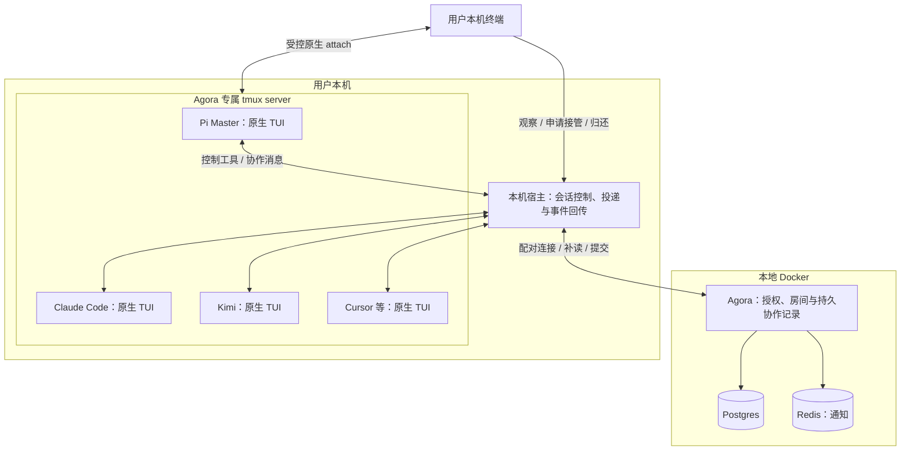

# Agora 本地 Agent 工作台计划

产品方向已确认，实施按阶段依赖和对应 Issue 的授权推进。本文描述目标，当前可运行能力见 [README](../README.md)。工单与进度以 [Agora Project](https://github.com/users/arvakme/projects/2) 关联的 Issues 为准，开发流程见[协作规则](development.md)。

## 1. 已确认范围

Pi 是 Master；Worker 是用户本机已安装的 Claude Code、Kimi、Cursor 等原生 Agent CLI 会话。默认隐藏的是界面，不是进程。用户可以 attach 到正在工作的同一现场，继续使用原生 TUI。

- Docker 只承载后端。本机启动入口管理专属 tmux 与宿主连接，复用用户自己的 Agent、登录态和模型配置。
- 一个工作房间由一个 Pi Master 协调。Worker 可交换事实、提出问题和返回结果；新任务、续派及最终验收由 Master 负责。
- Worker 从开始就是独立 CLI 进程，不采用 Firecode 的进程内 Pi 子会话，也不通过重开 JSONL 模拟实时 attach。
- 产品使用自己的 tmux socket 和配置，不依赖 Seedmux GUI；Seedmux 仅用于本次开发团队协作。
- 本轮不实现前端、Web 终端或画布接入。画布问答的呈现、修改权限、复用范围与 tldraw 许可须另行决定。

先交付的产品闭环是：**一个 Pi Master 指挥至少两种不同的原生 CLI，隐藏时继续工作，可进入原现场，结果可靠回到 Agora。** 不以两个 Pi SDK 子会话代替异构 CLI 验收。

## 2. 模块与事实归属

Docker 无法自行启动用户主机上的 tmux。仅启动 Compose 时，后端可用而未连接的本机宿主显示离线；完整启动入口才组合后端与本机现场，不通过挂载 Docker socket 或整个用户主目录跨越这个接缝。

| 事实 | 唯一权威位置 | 其他位置如何使用 |
| --- | --- | --- |
| Room、成员、授权、协作消息、任务请求与验收结果 | Agora / Postgres | Master 作语义决策；宿主读取和提交，不另维护可编辑任务池 |
| 会话控制身份与 Room 成员到原生会话的映射 | Agora | 宿主缓存恢复所需映射，不用名字、pane ID 或文件路径充当凭据 |
| 本机实际进程、终端存在性、当前输入权 | tmux 与本机宿主 | 后端显示带来源的观测；断连为未知，不推断成功或空闲 |
| Agent 对话与恢复上下文 | 各 CLI 原生持久化 | 宿主保存定位信息；仅显式公开的消息进入 Room，不复制全部终端与私有对话 |
| 待确认传输记录 | 发送端持久投递日志 | 接收端按事件 ID 幂等确认；这是传输记录，不是第二套任务状态机 |

画布获准接入后，图形、资产和原生评论留在一个画布权威存储中；Agora 只引用其稳定 ID。Room 消息序号与画布版本是不同事实。

### 保留协作内核，替换执行方式

保留现有房间 seq、事务内新鲜度、原子 claim、moderated 路由和 Computer 配对中仍适用的行为。Pi 与各 CLI 自己推理、使用工具和压缩上下文；Agora 不在外部再包一层 LangGraph。

原生路径取代现有图执行路径时，一并删除失去消费者的旧 daemon 推理分支、K8s turn 宿主、模型依赖、配置、测试和说明。迁移按调用关系收口，不先拆坏现有入口，也不在最终版本保留旧引擎回退开关。`World` 中有价值的房间读写能力可以内聚到协作模块，终端字节不进入房间世界接口。

图内已有的预算、取消后提交权限、使用量记账不会自动保护外部 CLI。必须将跨宿主成立的约束放在统一授权和提交处；没有原生 usage 的执行标为未知，不伪造零消耗。

## 3. 原生会话控制

本机宿主用一个深模块封装会话发现、输入投递、事件订阅和受控 attach；调用方不需要知道各 CLI 的按键、启动参数或记录格式。优先重构现有宿主职责并使用标准库、tmux 与 CLI 官方能力，不先建设供应商插件平台。

P0 用真实 CLI 验证接缝，再冻结最小请求、事件和身份模型。各 CLI 的差异限制在启动/恢复命令、可输入信号和完成回执中。Pi Master 的扩展只是这个接口的调用方，不拥有第二个 Worker Pool。

- 每个 Agent 有独立、默认 detached 的 tmux session。只接纳本部署内明确选定的会话；不扫描后自动接管用户其他终端。
- 输入经过同一会话的串行通道，先核对输入权和 CLI 可接收状态，再使用安全的原生输入方式；任务正文不能拼成 shell 命令。
- 采用官方扩展、hooks、结构化结果或文件 watcher 获取变化。终端安静、ANSI 文本、一次按键发送成功都不是任务完成证据。
- CLI 若缺少可靠的接收/完成信号，须先解决该 CLI 的接缝或明确阻塞其自动派发；手动终端可用不等于自动协作可验收。
- 中断请求区分停止投递与中断实际回合，并等待可验证的终态。发送 SIGINT 不自动等于已经停止；取消后旧结果不能被当成有效任务完成。
- Worker 向指定同伴或 Master 发送显式协作消息。进度、终端输出和确认回执不唤醒全员，也不产生无限互相回复。

### 观察与人工接管

默认入口使用只读 attach。可写入口先排他取得该会话的输入权，暂停自动投递，再连接同一 tmux 现场。接管不隐式取消正在运行的模型或 shell 命令。

接管 Worker 只暂停该会话的新输入；其他 Worker 可以继续。接管 Master 时，结果继续持久接收，但不自动注入新的 Master 回合；人可以在 TUI 中主动指挥。归还后重新核对尚未处理任务，不盲目重放旧按键或积压提示。

detach 不是取消，也不自动归还输入权。控制连接异常中断时保持暂停，等待明确归还或接管。发现未纳管的可写客户端时拒绝继续自动投递，不强踢用户。产品保证覆盖受控入口，不能把 tmux 多客户端机制或提示词当成对同一 OS 用户的安全沙箱。

## 4. 留存与可靠交付

专属 socket、配置和部署身份彼此绑定；所有 tmux 操作显式指定 socket，不借用默认 server 或 Seedmux 的 socket。启动与恢复由同部署单实例锁保护，先发现已有现场，再决定是否创建。使用适合原生终端的 detach 与切换操作，不照搬 Seedmux 的 GUI 按键配置。

| 事件 | 预期行为 |
| --- | --- |
| 关闭浏览器、隐藏 Worker 或 detach | CLI 继续运行；隐藏本身不触发模型调用 |
| Docker 后端重启 | tmux 与本机 CLI 不退出；已接受输入和未确认结果可核对、补投 |
| 本机宿主重启 | 重连已有会话并恢复输入权记录；不重复启动 CLI，不把未知状态改为空闲 |
| Pi Master 退出 | 独立 Worker 不随之退出；结果留存，不自动创建另一个 Master |
| Worker 退出或认证失效 | 明确记录退出/阻塞原因；不偷偷换账号、模型或新会话继续 |
| 机器或 tmux server 重启 | 原进程和屏幕内存消失；经明确恢复操作使用 CLI 原生记录，不声称是原进程 attach |
| 停止后端 / 清理项目 | 默认不杀本机 Agent；结束进程和删除历史是分别确认的动作 |

会话索引和待确认传输记录位于本部署的持久目录，凭据仍由用户 CLI 管理。tmux scrollback 有界且不作为持久日志；首版不连续录制全部 PTY 字节。保留原生记录及必要归档到用户显式清理，不复制认证文件进入备份。

交付遵循以下顺序约束：

1. 输入先在 Agora 持久化，再发通知；Redis/WS 只表示有更新，重连按游标补读。突发通知可以合并，明确任务不能被合并丢失。
2. 宿主接受输入与 Agent 完成执行分别确认；新请求、结果和取消都携带稳定身份。发送端保留未确认记录，接收端幂等提交。
3. 崩溃发生在输入注入或副作用窗口时，状态是不确定，先核对原生现场。不能因为缺少 ACK 就自动再次执行修改，也不承诺模型 exactly-once。
4. 最终结果与 Master 验收分开；重复结果只补确认，不重复发帖或开启推理。等待使用事件，不定时轮询整份 transcript。

复用官方 CLI 和本地认证不构成免封号承诺；仍遵守各供应商条款、额度与权限提示。会话留存也不能消除登录过期或原生上下文限制。

## 5. 本地安全与部署

目标先限定为单用户、单后端实例和本机 loopback 入口，不建设 OAuth/SaaS 或多副本。用户凭证必须绑定作者与允许控制的会话；仅凭房间 UUID 不能发帖、接管终端或提交结果。沿用 Computer 配对，校验跨 Room/宿主访问和浏览器来源。

数据库默认不暴露到局域网；控制 socket 与本地文件限制为当前用户可用。日志、Issue、PR 和归档均不包含 token、登录文件或完整私有对话。CLI 的高权限选项只在明确授权的工作目录与任务范围内生效，不能把原生 CLI 当成隔离沙箱。

Docker 阶段交付 API、现有必要存储、数据卷、健康检查及最小本机启动入口。CLI 仍在宿主运行，不为“全在 Docker”复制模型运行时或用户 home。备份、停止和恢复流程随实际存储实现更新，不另建并行管理面。

## 6. 画布决策门

画布仅进入决策，不默认选择“先只读问答”，也不提前实施画布适配层。需由用户确认问题输入/回答放在哪里、选区权限、是否需要图形修改，以及是否允许迁入前端。

canvas-agent 使用 tldraw 5.4.0；该 SDK 是 source-available、自定义许可，不是宽松开源。[L1] 默认许可覆盖内部开发、测试和 staging；localhost 不触发生产校验，并不等于长期日常使用已经获得许可。技术上的白屏与合法授权是两件事。[L2] [L3]

- 接受当前 SDK：先核实适用的个人非商业授权、归属展示和部署条件，再决定复用范围。
- 严格使用开源 tldraw：v1 是 MIT，但已经归档，不能直接复用 5.4 的同步、schema 与评论；需重新比较维护成本。[L4]
- 严格开源且不接受旧版：另行评估绘图库，未经用户选择不替换 tldraw。

canvas-agent 已检查版本未发现 LICENSE，复制或分发其代码前另行确认授权。以上未决项只阻塞画布阶段，不阻塞原生终端和协作后端。

若后续获准接入：画布只保留一个同步权威源；关闭迁入范围内的旧 runner 与独立聊天调度；按稳定页面/图形/线程 ID 关联 Agora。选区在提交问题时固定，不读取执行时后来变化的“当前选区”。若允许改图，再约束类型化操作、记录新鲜度、范围授权、去重与撤销；聊天 seq 和 claim 均不能替代图形冲突校验。不采用整图回滚或任意浏览器 JavaScript 作为默认写接口。

## 7. 阶段与交付门

以下是依赖顺序，不是第二份任务状态表；具体范围、认领、阻塞与验收记录仅在 Issues 维护。每阶段进入实施前确认授权。

| 阶段 | 工作 | 进入下一阶段的证据 |
| --- | --- | --- |
| G0：计划与治理 | 本文、仓库规则、Project 和依赖工单 | 文档检查与远端关系核对；不包含产品编码 |
| P0：接缝验证 | 团队预检可与 G0 发布并行；验证原生 CLI 控制信号并冻结共享接口；建立审查/合并门 | 精确模型与权限明确，真实 CLI 可控制且不丢原生 TUI；共享接口唯一，合入门可执行 |
| P1：并行基础 | 本机 tmux 宿主与受控 attach；Agora 授权和持久投递 | 各自接口上的可信回归通过，双方可按冻结契约集成 |
| P2：集成与交付 | Pi Master/异构 CLI 协作、旧执行链清理；本地 Docker；真实故障验收 | 至少两种非 Pi Worker 完成闭环，同现场 attach、单写者、重连去重与退出恢复均有证据 |
| 画布决策 | 独立确认许可、前后端范围与交互 | 用户选定后才拆实现工单，不强行并入 P2 |

P1 的宿主与后端按路径并行；P2 的 Master 接入与部署按路径并行。共享类型、schema 和入口始终单写者；实际分配以派发时最新代码为准。测试、文档和删除失效逻辑属于每张实现工单，不留到单独“大扫除”阶段。

P2 必测：重复启动不创建第二 Master；后端和宿主重启不杀存活 CLI；Master 退出不杀 Worker；只读不可输入；接管与自动投递排他；结果 ACK 丢失不重复发帖；注入窗口崩溃不盲目重跑；错误身份不能控制其他会话；真实 CLI 完成而不是假回执。尚无产品界面时，浏览器验证不能替代这些终端与后端证据。

## 8. 证据入口

- Agora 当前实现：[设计说明](design.md)、[测试入口](testing.md)、`server/scheduler.py`、`server/db.py`、`server/auth.py`、`daemon/main.py`、`brain/world.py` 与 Compose。原有文档描述现状，不构成保留旧执行路径的要求。
- canvas-agent：检查提交 `119ee5124408264424f3c1ce96ab9fdb8bd473e4` 的[内部契约](https://github.com/arvakme/canvas-agent/blob/119ee5124408264424f3c1ce96ab9fdb8bd473e4/docs/api-contract.md)和实际 runner/同步实现；再次复用时核对差异与授权。
- tmux：[官方手册](https://man.openbsd.org/tmux.1)、[Control Mode](https://github.com/tmux/tmux/wiki/Control-Mode)。本机 Seedmux 配置仅作为隔离和事件实现的只读参考。
- Pi：[扩展接口](https://github.com/earendil-works/pi/blob/main/packages/coding-agent/docs/extensions.md)。各 CLI 的安装版本、hooks、精确模型与恢复能力在 P0 实测，不把命令名称视为能力保证。

[L1]: https://github.com/tldraw/tldraw/blob/v5.4.0/LICENSE.md
[L2]: https://tldraw.dev/community/license
[L3]: https://tldraw.dev/sdk-features/license-key
[L4]: https://github.com/tldraw/tldraw-v1
