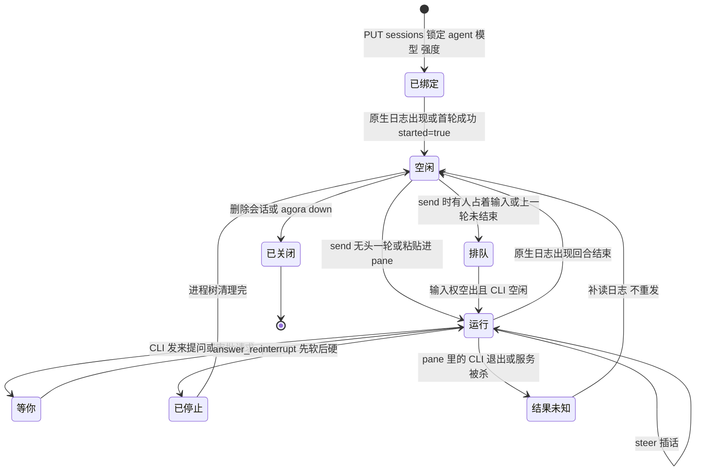
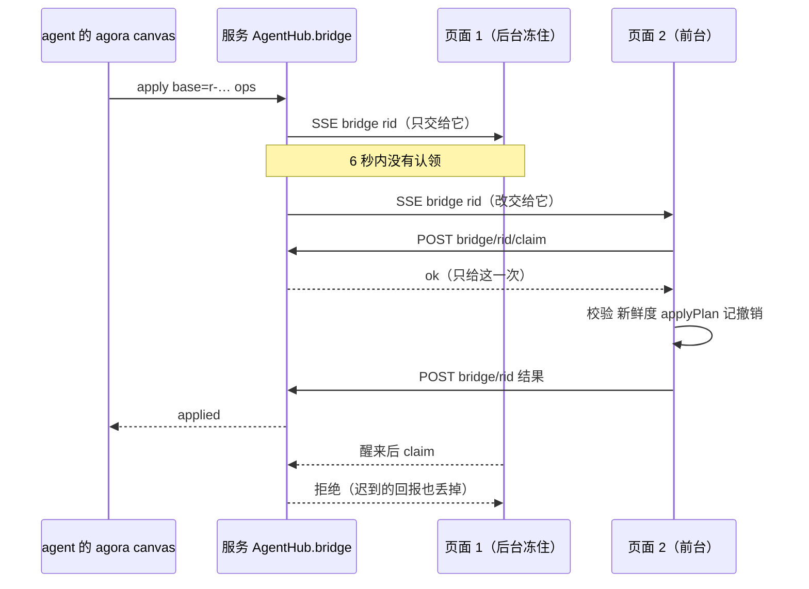
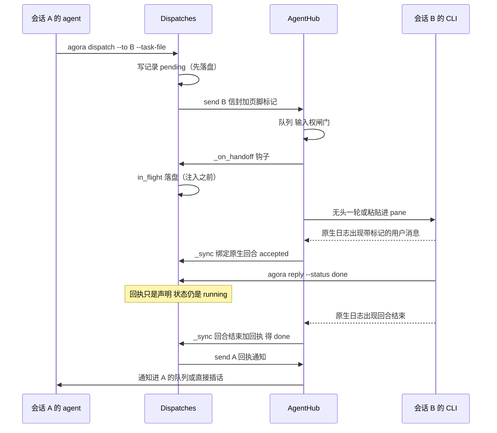
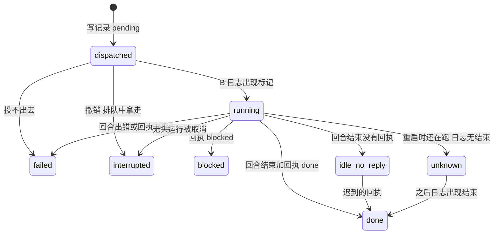

# Agora 后端编排：Agent 生命周期

本文讲 Agora 服务端这一层**控制平面**：一个会话从绑定到关服会经过哪些阶段，一个任务怎么从会话 A 交到会话 B。每条断言都指向仓库里的 `路径::符号`（路径相对仓库根；`::` 后是函数、类或测试名），写不出证据的不写。契约字段只在 [`native_protocol.py`](../native_protocol.py) 定义；按用户视角的说明见 [Agent 会话](../web/docs/agent-sessions.md)、[派发](dispatch.md)，这里只讲编排的问题、机制、不变量和失败模式。

## 1. 定位

| Agora 拥有（控制平面） | Agora 不拥有（用户自选的原生 harness） |
|---|---|
| 会话身份：哪个原生会话、哪个 agent / 模型 / 强度，锁定且可恢复 | agent 循环、工具循环、上下文管理 |
| 进程与窗格的托管：无头进程、常驻进程、tmux pane、环境清洗、进程树清理 | 模型与推理 |
| 投递与仲裁：队列、输入权、什么时候能往 CLI 里说话 | 各 CLI 的权限与沙箱（沿用用户自己的配置，`--scope` 只是提示） |
| 事实记录：派发记录、状态机、重启后的对账 | 对话记录本身（以 CLI 自己的日志为准，不另存） |
| 画布桥接：谁来执行 agent 发起的改图 | 子 agent 的调度（Claude 的 Task、Codex 的 spawn 是 CLI 自己的，Agora 只观察） |

被托管的 CLI：Pi、Claude Code、Codex、Grok、Cursor、Devin——注册表里都是 T1 会话 agent（`server/canvas/adapters/registry.py::session_kinds`，测试 `tests/test_adapter_registry.py::test_session_agents_are_the_t1_adapters`）。每家的差异收在 `server/canvas/adapters/` 一个文件里，见 [CLI 适配层](../web/docs/cli-adapters.md)。

**为什么这样划分：原生会话就是会话。** 终端和面板用同一个原生 id，哪边说的话另一边都接得上；对话以 CLI 日志为准，Agora 只跟随（`server/canvas/sessions.py::AgentHub`）。项目早期走过另一条路——房间调度、LangGraph、Postgres、Redis——后来整条链删掉，只留原生会话一条执行路径（提交 `e4bdee1`，[`AGENTS.md`](../AGENTS.md)）。代价同样明确：每家 CLI 的日志格式和协议都要适配并防漂移（`tests/test_adapter_contracts.py`、`server/canvas/adapters/drift.py::probe`），能力被 CLI 限制（例如 Grok、Cursor、Devin 的无头模式不能中途插话）。

## 2. 生命周期总览

贯穿所有阶段的三条规矩：

1. **证据在 CLI 自己的记录里。** 「已送达」「已完成」只认原生日志、钩子、通知；tmux 命令成功、终端安静、模型打出 done 都不算（`native_protocol.py::EvidenceKind` 的文档，`ACCEPT_EVIDENCE`、`OUTCOME_EVIDENCE` 两个集合里没有终端字节，也没有进程退出）。
2. **宁可报「未知」，不重发有副作用的东西。** 注入窗口里失去确认 = `uncertain`，重启只对账不重投（`native_protocol.py::plan_recovery`）。契约明说不承诺 exactly-once。
3. **每个起出来的进程都有登记和清理责任人。** 一轮的进程树被记住（`server/canvas/proctree.py::Watch`），服务死了留下的由下一个服务按登记清掉（`server/canvas/sessions.py::AgentHub._reap_orphans`）。

## 3. 逐阶段

### 3.1 绑定：会话身份

- **目标**：一个 Agora 会话固定对应一个原生会话，agent、模型、强度选定后不变；重启、移动项目、丢日志之后仍能认出它。
- **机制**：绑定文件由服务端写（`server/canvas/project.py::ProjectStore.bind`，不同的 agent/模型/强度抛 `Locked` → 409）；`nativeId` 只能从空设一次（`ProjectStore.set_native`）；`started` 表示原生日志存在过，`mark_started` 置位后只续接、永不再用 `--session-id` 新建（`server/canvas/sessions.py::binding_started`）；`natives` 记每个用过的原生 id，`pendingFork` 记下一轮从哪分叉，改绑只走记录在案的恢复流程（`ProjectStore.rebind`）。找日志按 CLI 各自规则（`server/canvas/agents.py::locate_log`）。
- **不变量**：身份只由服务端写；已开始的会话找不到日志时**不启动 CLI**，也不用同一个 id 静默新开（`server/canvas/agents.py::check_native` 抛 `NativeMissing`，`AgentHub.check_native` 再挡住「随项目副本带来、尚未分叉」的会话：`Copied`）。
- **失败与处置**：日志缺失 / 多份 / 在别的目录 → 409 并说明，面板给「带摘要开新会话」等出路；项目被复制 → 副本里只读，分叉后才能继续；Pi 日志随项目移动迁移，迁不了就标记下一次分叉。
- **测试**：`tests/test_agent_sessions.py::test_binding_is_fixed_once_chosen`、`tests/test_agent_sessions.py::test_binding_api_locks_and_goes_with_the_session`、`tests/test_lifecycle.py::test_check_native_refuses_a_started_session_without_log`、`tests/test_lifecycle.py::test_claude_never_gets_session_id_for_a_started_session`、`tests/test_instance.py::test_copy_gets_its_own_instance_and_its_sessions_are_read_only_until_forked`。

### 3.2 启动：无头与终端托管

- **目标**：用用户自己的 CLI、项目根目录、干净的环境起一个 agent，它能调 `agora` 命令回到服务。
- **机制**：
  - 无头：`AgentHub._run_headless` 组一个 `RunRequest`（会话 id、`new_session=not binding_started(b)`、`cwd` 为项目根、环境里有 `AGORA_PROJECT` / `AGORA_SESSION` / `AGORA_CANVAS`，见 `AgentHub.env_for`），交适配器的后端执行。Claude 一轮一个进程、stdin 保持打开（双向协议，[Claude 无头双向](claude-headless-duplex.md)）；Codex、Pi 一个会话一个常驻进程（`server/canvas/resident.py::ResidentPool`）。
  - 终端：`AgentHub.open_terminal` → `server/canvas/terminal.py::Terminals.open`：每个项目一个独立 tmux 服务器，pane 里直接跑交互式续接命令，CLI 退出 = pane 结束 = 不再持有；登记真实 pane id、CLI pid 与启动时间，存活判断对照 tmux 与 `ps`（`server/canvas/terminal.py::judge`）。
- **不变量**：
  - 子进程环境清洗：去掉外层 agent 的嵌套标记（继承下来 Claude Code 会停止写会话日志，同步通道就断了）和 `SEEDMUX_*`（`server/canvas/agents.py::child_env`、`_NESTED`）。
  - 同一原生会话不能同时两个进程写：无头一轮进行中不能开终端（`server/canvas/sessions.py::Busy`），pane 活着时消息走 pane、不新起 CLI。后者是机制，**没有专门测试**。
- **失败与处置**：常驻进程起不来 → 这一轮退回一次性跑法，发 `resident` 事件写明原因，CLI 自身的问题记 5 分钟不再每轮试；二进制不存在、非零退出都作为显式错误事件，不吞。
- **测试**：`tests/test_agent_backends.py::test_run_in_project_dir_with_agora_env`、`tests/test_terminal_input.py::test_child_env_leaves_out_seedmux_variables`、`tests/test_terminal_input.py::test_a_headless_turn_is_started_without_seedmux_variables`、`tests/test_resident.py::test_codex_without_an_app_server_falls_back_and_says_why`。

### 3.3 一轮运行：投递、队列、输入权

- **目标**：消息不丢、不重、不打断正在打字的人，且「送达」有原生证据。
- **机制**：`AgentHub.send` 分流：pane 活着进 `lv.pane` 队列，否则进 `lv.headless` 队列，由 `_kick` → `_run_headless` 一次一轮。pane 投递在 `AgentHub._tick_async` 里逐条判断：输入权闸门（`server/canvas/terminal.py::gate_hold`，接管或有不归 Agora 管的可写窗口就暂停）、CLI 刚启动（`PANE_BOOT_S` 6 秒内粘贴会丢）、上一轮未结束；通过后先调 `_handoff` 钩子再 `Terminals.paste`。人可以「现在送出」放行队首一条（`AgentHub.deliver_now`，只这一条越过闸门）。接管不随 detach、连接断开、服务重启而归还（`Terminals.takeover` / `give_back`）。
- **不变量**：队列不丢；人占着输入时什么都不往里打；送达以原生日志里出现这条用户消息为准（`DELIVERY_CONFIRM_S` 30 秒没出现就如实说「终端没有确认收到」）。
- **失败与处置**：粘贴成功而回车失败（`PasteSubmitFailed`）→ 这条**不**改走无头重发（会做两遍），记「结果未知」并告诉人按回车；CLI 在一轮中途退出 → `AgentHub._pane_exited` 先读完它退出前写下的日志，再对「日志里没有结束记录」的那一轮报 `outcome: unknown`；pane 退出且消息还没粘贴 → 才改走无头。
- **测试**：`tests/test_terminal_input.py::test_takeover_pauses_the_queue_and_giving_back_delivers_it`、`tests/test_terminal_input.py::test_a_writable_attach_holds_delivery_and_a_read_only_one_does_not`、`tests/test_terminal_input.py::test_a_forced_message_goes_past_every_hold_but_only_that_one`、`tests/test_terminal_input.py::test_a_cli_that_exits_mid_turn_is_reported_as_unknown_not_done`、`tests/test_dispatch.py::test_a_paste_whose_enter_failed_is_not_run_again_by_the_headless_path`。

### 3.4 运行中：插话、「等你」、画布桥接

**插话（steer）。** `AgentHub.send(mode=…)`：`auto` 能插就插（写进这一轮的 stdin 或常驻进程，`Control`），不能就排队；`steer` 对不能的 CLI 直接拒绝并说明原因；`interrupt` 先停这一轮再把话作为新一轮发出；`wait` 保持排队。Claude、Codex、Pi 能 steer，Grok、Cursor、Devin 的 `-p` 没有输入口（`server/canvas/adapters/grok.py::GrokAdapter.no_steer` 等）。程序化调用方（派发、评论交接）不带 mode，所以不会替没人看着的调用方「选择停止」。测试：`tests/test_steer.py::test_a_steerable_cli_gets_the_words_at_once_and_the_step_is_marked`、`tests/test_steer.py::test_a_cli_that_cannot_steer_refuses_a_steer_and_says_why`、`tests/test_steer.py::test_a_caller_that_names_no_mode_keeps_the_old_queue_for_a_cli_that_cannot_steer`。

**请求 / 审批「等你」。** Claude 无头是双向协议：CLI 的提问或审批请求变成 `Live.requests`（运行时事实，不落盘、不重放），对应工具调用在转录里标成 `waitsUser`（`AgentHub._open_request`、`_mark_wait`），人的回答经 `AgentHub.answer_request` 写回 stdin。没人回答就一直等、不自动拒绝，等人的时间不计入无活动超时和总时长上限（`turn_clock.py`），界面显示等了多久；被 auto 在 CLI 内部拦下的操作没有可批的请求，只在对话里留一行（`_note_denied`）。测试：`tests/test_agent_requests.py::test_a_question_waits_for_the_person_and_the_answer_goes_back`、`tests/test_agent_requests.py::test_a_request_nobody_answers_is_waited_for_and_says_for_how_long`、`tests/test_claude_duplex.py::test_a_pending_request_is_not_a_timeout`。

**画布桥接：页面执行器认领协议。** `agora canvas apply` 由一个打开的页面执行（它持有画布、校验、记撤销）。

- **乐观并发**：`read` 把每个元素的版本记成一个 `base` 令牌（`server/canvas/sessions.py::save_read`），`apply` 带着它回来，引用的元素在读取后被改过就返回 `stale`、一条都不落（`server/canvas/plan_rules.py::stale_ids`，与页面的 `staleIds` 同一批用例）。
- **挑页面**：可见、上次答上来了、最近聚焦、最近连接的优先（`server/canvas/executors.py::order`）。
- **先认领再执行**：请求交给第一个页面，`PAGE_REPLY_S`=6 秒内没认领就交给下一个，总共不超过 `BRIDGE_TIMEOUT_S`=25 秒（`AgentHub.bridge`）；服务端只把认领给**正被交给的那个页面、且只给一次**（`AgentHub.claim_bridge`），被跳过的页面（冻住的后台标签）醒来后认领被拒、迟到的回报被丢。**已认领的页面不会被换掉**（它的改动可能已经落在画布上），等不到回报就报 `PageTookIt`，让 agent 先看图再决定重试。
- **降级**：都不认领时自己打开页面（2 分钟最多一次）→ 再不行服务端直接改文件，但只做不需要改图引擎的操作，其余整条返回 `needs-page`、一条都不执行（`server/canvas/page_help.py::edit`、`server/canvas/fallback.py::apply`）。有页面认领了却没回报时**停在这里报错，不走降级**。
- **测试**：`tests/test_executors.py::test_a_page_that_does_not_take_it_is_skipped_and_its_late_answer_is_dropped`、`tests/test_executors.py::test_a_page_that_took_it_is_waited_for_not_replaced`、`tests/test_executors.py::test_the_edit_lands_once_a_page_runs_it_only_after_a_claim`、`tests/test_plan_rules.py::test_freshness_names_the_elements_changed_since_the_read`、`tests/test_page_fallback.py::test_an_existing_page_is_still_tried_first_and_a_page_that_took_it_is_never_replaced`、`tests/test_page_fallback.py::test_what_a_server_cannot_do_says_it_needs_a_page_and_changes_nothing`。

### 3.5 子代理与派发

会话间委托是 Agora 自己的一套记录与状态机，原生子 agent 只观察，详见第 4 节。

### 3.6 结束与中断

- **目标**：停下一轮时，这一轮起的**整棵**进程树都结束，状态对得上。
- **机制**：`AgentHub.interrupt`：双向 CLI 先发 interrupt 请求，挂着的请求随之撤掉，等 CLI 自己以 `result` 干净结束；`INTERRUPT_GRACE_S`=15 秒不结束才取消任务，强停进程。无法对话的进程（一次性、常驻进程尚未起来）直接取消。强停走 `server/canvas/agents.py::stop_group` → `server/canvas/proctree.py::stop`：一轮在跑时每秒记下后代进程及各自启动时间（`Watch`，CLI 退出后它们被 init 收养就找不到了），停止时先 SIGTERM 整个进程组和组外的后代，`GRACE_S` 后对仍在的 SIGKILL；pid 被系统复用的（启动时间对不上）不碰。
- **不变量**：只动这一轮自己的进程，不按名字、不碰别的会话；一轮被停掉即使日志没有结束记录也算结束（`AgentHub.close_stopped_turn`：没完成的调用标「已停止」，会话转空闲）。
- **失败与处置**：Grok 的无头一轮被 SIGTERM 杀掉后日志里没有结束标记，终态不确定，文档里明写未修（[CLI 适配层](../web/docs/cli-adapters.md)「Grok 作为 T1 会话 agent」）；终端 pane 里的一轮没有停止键，派发记录如实记 `unknown`（见 4.3）。
- **测试**：`tests/test_proctree.py::test_stop_ends_the_group_the_detached_children_and_what_ignores_sigterm`、`tests/test_proctree.py::test_stop_still_collects_the_children_when_the_cli_died_first`、`tests/test_proctree.py::test_a_remembered_pid_that_now_belongs_to_another_process_is_not_killed`、`tests/test_agent_requests.py::test_interrupt_with_a_request_open_ends_the_turn_and_withdraws_the_card`、`tests/test_agent_requests.py::test_interrupting_a_waiting_turn_leaves_no_process`、`tests/test_resident.py::test_codex_interrupt_ends_the_turn_and_keeps_the_process`。

### 3.7 重启恢复

- **目标**：服务被杀或崩溃后，不留孤儿进程，不重复做事，不漏通知。
- **机制**：
  - 一轮开始时在 `.agora/run/headless/<会话>.json` 登记 CLI 的 pid 和完整命令行；下一个服务启动时 `AgentHub._reap_orphans` 读到还在的登记，**只有 pid 仍在跑同一条命令才**结束它的整棵树（`server/canvas/sessions.py::_stop_process`，pid 会被复用），对话里写一行「上一轮随服务重启中断了，不会自动重来」。常驻进程同理（`ResidentPool.leftovers`，下一轮 `thread/resume` 从原生日志接上，不重发消息）。
  - 派发记录对账：`server/canvas/dispatch.py::Dispatches.recover` 对每条未结束的记录跑 `plan_recovery`——没交出去的（`pending`）照常投；可能已注入的（`in_flight`）先读目标的日志找标记，找不到记 `uncertain`，**绝不重发**；重启时还在跑的一轮记 `uncertain`，之后日志里出现结束记录仍会结算它。已结束但来源没被通知到的，补发通知**且只发一次**（见 4.2）。
- **不变量**：一个被撤销的派发永远不再投递；「没有确认」从不等于「可以再跑一遍」。
- **失败与处置**：命令行比对失败（例如 Linux 的 `ps` 在管道里按 `$COLUMNS` 截断长命令）就放弃动手——所以 `proctree` 的 `ps` 一律带 `-ww`（提交 `89298f1`，`tests/test_proctree.py::test_the_command_of_a_process_is_whole_even_when_the_terminal_is_narrow`）。
- **测试**：`tests/test_agent_requests.py::test_a_turn_a_restart_ended_is_recorded_and_never_replayed`、`tests/test_agent_requests.py::test_a_marker_never_ends_a_process_that_is_not_the_recorded_command`、`tests/test_proctree.py::test_a_leftover_turn_of_a_dead_server_is_ended_with_its_tree`、`tests/test_resident.py::test_leftovers_of_a_dead_server_are_listed_for_the_next_one_to_stop`、`tests/test_dispatch.py::test_after_a_restart_nothing_that_may_have_been_injected_is_sent_again`、`tests/test_dispatch.py::test_a_pending_record_that_was_never_handed_over_is_delivered_after_a_restart`、`tests/test_native_protocol.py::test_uncertainty_reconciles_before_a_side_effecting_request_runs_again`。

### 3.8 关服

- **目标**：收到一次 SIGTERM 就干净退出，不被任何一个挂着的东西拖住。
- **机制**（`server/canvas/shutdown.py`）：第一次信号 `trigger()`：由服务端主动结束所有 `text/event-stream`（`CloseStreamsOnShutdown` 取消处理函数，它自己的 `finally` 照常退订），在途的普通请求做完，之后新开的流立即结束；第二个信号停止一切等待；`HARD_EXIT_S`=20 秒的看门狗兜底强退。应用自己的收尾按顺序、**每一步有上限**（`shutdown.bounded`，`server/canvas/project_router.py::create_project_app` 的 `lifespan`）：后台任务 3 秒 → 分享网关 → 分享隧道 8 秒 → `AgentHub.close` 12 秒。`close` 取消每一轮并**等它们的 `finally` 跑完**（进程树 SIGTERM 再 SIGKILL）、关掉常驻进程、让等页面的改图立刻返回「服务正在关闭」。
- **不变量**：等着回答的 `claude -p` 不会在 `agora down` 之后留下。
- **失败与处置**：某一步超时只打印、不抛，后面的步骤照常执行。
- **测试**：`tests/test_shutdown.py::test_an_open_event_stream_is_ended_when_the_server_is_told_to_stop`、`tests/test_shutdown.py::test_bounded_gives_up_on_a_step_that_hangs_and_says_which`、`tests/test_shutdown.py::test_a_server_with_pages_open_exits_on_the_first_sigterm`、`tests/test_shutdown.py::test_agora_down_gets_a_clean_exit_with_pages_open_not_a_sigkill`、`tests/test_agent_requests.py::test_closing_the_hub_with_a_request_open_ends_the_process_before_it_returns`。

## 4. 派发与 sub agent

两层要分开：**原生子 agent**（Claude 的 Task、Codex 的 `spawn_agent`）是 CLI 自己调度的，Agora 只观察；**派发**（`agora dispatch`）是 Agora 做的会话间委托：会话 A 的 agent 把任务交给会话 B（已有的，或新建一个 Claude / Codex / Pi …），Agora 记账、投递、看 B 接没接、做完没、交回没。后者是本节主体，实现是 `server/canvas/dispatch.py::Dispatches` 加 `server/canvas/dispatch_store.py`，状态机用 `native_protocol.py` 的纯函数。

### 4.1 一次派发

- **目标选择**：`--to <会话>` 或 `--new claude|codex|pi|…`（`Dispatches.dispatch`、`Dispatches._new_session`：新建绑定、校验模型与强度、装 skill）；不能派给自己，目标必须是 T1 会话 agent。**派给谁、何时派，是 agent 自己的判断**，Agora 不替它选（提示写在 `skills/agora/references/dispatch.md`）。
- **任务文本**在 `.agora/dispatch/<id>/task.md`，B 收到的只有一行信封（任务文件路径、怎么交回执）加页脚里的 `dispatch=<id>` 与 `agora-req-<id>` 标记（`server/canvas/agora_msg.py::envelope`、`native_protocol.py::binding_marker`）。
- **送达证据**：B 自己的日志里出现带标记的用户消息 = 已接收，不需要 B 报告（`Dispatches._sync`）。标记只用来找到那一条输入，绑定之后一切按原生回合 id 关联。
- **测试**：`tests/test_dispatch.py::test_pending_then_in_flight_then_accepted_then_done`、`tests/test_dispatch.py::test_a_message_with_another_marker_or_no_marker_is_not_this_dispatch`、`tests/test_dispatch.py::test_a_new_session_is_made_and_bound_like_one_made_by_hand`、`tests/test_dispatch.py::test_a_person_holding_the_pane_leaves_it_queued_with_the_reason_and_it_goes_when_given_back`。

### 4.2 回执语义：谁先到、去重、通知一次

- **谁先到**：状态是记录的纯函数（`server/canvas/dispatch_store.py::derive_state`）。回执在回合结束**之前**到，只是声明，状态仍是 `running`；回合结束时才结算；回合结束而没有回执 = `idle_no_reply`（通知照发，文案写「没有交回执」）；回执**晚到**照样改状态并再通知一次（历史是 `dispatched → running → idle_no_reply → done`）。服务不可达时 `agora reply` 写 `<id>/reply.status`，服务下次看到时接收（`Dispatches._take_reply_file`）。
- **通知一次**：`notified` 只在 `hub.send` 成功之后才记；同一个 (记录, 状态) 同时只有一条通知在发（`_notifying`）；发送失败原因写进记录，不吞，重启再试一次（`Dispatches._notice`）。
- **去重**：发通知时记录写下 `notice={state, mark: true}`（这一次带了 `agora-receipt-<id>:<状态>` 标记）；重启补发前先看 A 自己的日志里有没有这个标记，有就只补记「已通知」（`Dispatches._already_told`）；**没有 `notice` 字段的老记录一律不补**——那时的通知本来就没有标记，日志里找不到不代表没送到（坑见 [面试讲法](orchestration-interview.md)）。
- **撤销**：撤销是不可逆的决定，之后不再投、结果不发布；已经注入的一轮可能继续跑，它迟到的结果留作证据但 `publishable_result` 不放行（`Dispatches.interrupt`，`native_protocol.py::publishable_result`）。终端 pane 里的一轮这里没有停止键，记 `unknown`，不假装停了。
- **测试**：`tests/test_dispatch.py::test_failed_and_blocked_receipts`、`tests/test_dispatch.py::test_a_turn_that_ends_with_an_error_is_failed_with_that_error`、`tests/test_dispatch.py::test_a_receipt_written_as_files_is_taken_up`、`tests/test_dispatch.py::test_a_failed_notification_is_not_marked_as_sent_and_says_why`、`tests/test_dispatch.py::test_a_note_the_source_already_shows_in_its_log_is_not_sent_again`、`tests/test_dispatch.py::test_an_old_record_without_the_marker_field_is_not_told_again_after_a_restart`、`tests/test_dispatch.py::test_a_result_that_arrives_after_the_withdrawal_is_kept_but_not_published_or_told`、`tests/test_dispatch_store.py::test_the_state_is_a_pure_function_of_the_record`。

### 4.3 父子关系与回到父

- **怎么追踪**：`GET /api/agent/runs?session=<A>` 返回 A 的 run 树：A 自己、原生子 agent（各适配器的 `children`，父子证据是 CLI 自己写的，例如 Claude 父 `Agent` 调用的 `tool_use.id` = 子 agent 元数据文件里的 `toolUseId`，Codex 是 `thread_spawn_edges`）、以及 A 派出的会话（`parent.via = "dispatch"`，`taskId` 是记录 id，`state` 直接取记录；`server/canvas/agent_router.py::agent_runs`）。没有人维护第二份父子表。
- **一个 turn 里派发的孩子完成后怎么回到父**：通知走 `AgentHub.send(A, …)`（不带 mode）。A 的 CLI 能 steer（Claude / Codex / Pi）且这一轮还在跑，回执直接插进这一轮，在下一步读到；不能 steer 就排在这一轮之后。通知文案写明「这是通知，不需要回复」，所以 A 不会回一句「同一份回执的重复通知」再跑一轮。回执里的答复是**数据**，skill 告诉 A 用之前先检查（`skills/agora/references/dispatch.md`）。
- **不同 CLI 的子 agent 事实**（[CLI 适配层 §3](../web/docs/cli-adapters.md)）：Claude 的 `Agent`/Task 有独立的 `subagents/agent-*.jsonl` 和配套的元数据文件；Codex 的 `spawn_agent`（`CollabAgentToolCall`、`SubAgentActivity`）有父 rollout 加索引边，审批守卫线程隐藏；Grok 的 `spawn_subagent`、Cursor 的 Task / Subagent 也能观察到（Cursor 的结果不带子 id）；Devin 的 `run_subagent` 本机没有真实样本，只是把子链排除出主轨迹，没做成子 run；Pi 没有子 agent。这些子 agent 在 Agora 里是只观察的 run（T2）。
- **测试**：`tests/test_dispatch_api.py::test_the_run_tree_has_the_dispatched_session_under_the_giver_with_the_records_state`、`tests/test_agent_runs.py::test_claude_subagents_are_child_runs`、`tests/test_agent_runs.py::test_codex_spawned_threads_are_child_runs_and_guardians_are_hidden`、`tests/test_steer.py::test_steer_also_works_for_a_dispatch_and_a_comment_hand_off`。

### 4.4 验收

Agora 验收的是**事实**，不是**工作质量**：B 的回合结束了吗、有没有回执、回执是 `done` 还是 `blocked`、记录里留着经过的每个状态和时间。这份记录不判断 B 做得对不对；`done` 只表示「对方自己说完成了，且回合确实结束了」。工作对不对由 A 的 agent 检查（skill 里要求），人也能在画布上看到 B 读写了哪些文件。

## 5. 已知边界与可以往上做的方向

**现状要说清楚**：策略层——何时派发、怎么拆任务、派给谁、怎么验证——现在主要由 agent 自己决定，Agora 提供的是通路（投递、记录、对账）、凭证（回执与原生证据）和观察（run 树）。下面这些是没做的，不是已经做了的。

已知边界：

- 无头协议只有 Claude 是双向的；Codex、Pi 靠常驻进程插话，Grok、Cursor、Devin 不能中途插话，中断后只能新开一轮。
- 终端 pane 里的一轮不能从 Agora 停止（派发记录只记 `unknown`）。
- 单机、单项目：不做多机、跨项目派发；权限沿用各 CLI 的配置，`--scope` 只是提示不是沙箱。
- 同一原生会话不能同时两个进程写，这条靠分流而不是锁，没有专门测试。

可以往上做的方向：

1. **依赖图派发**：现在每个派发彼此独立，先后顺序靠父 agent 自己等回执；记录里已有父子和状态，加上依赖边就能由服务端保证「B 完成才派 C」、汇总多个子任务，而不是让父 agent 的上下文去记。
2. **验收循环成为一等公民**：`idle_no_reply`、`blocked`、`failed` 已经是明确的信号，但「检查 → 打回重做」目前是父 agent 的一段话；把它变成记录里的一个状态，才能统计打回率、避免无限循环。
3. **预算与超时**：现在只有一轮的无活动超时（30 分钟没有任何输出才中止）和 6 小时的总时长保险丝（`server/canvas/turn_clock.py`，`AGORA_TURN_IDLE_TIMEOUT_S` / `AGORA_TURN_MAX_S`），以及 `agora dispatch wait --timeout`（只是等待上限，不会取消对方）；每轮用量已经落盘，按树汇总并设上限是顺手的事，也能防一个失控的子任务烧钱。
4. **编排评测**：仓库里的评测只覆盖画布改图（见 [README](../README.md)「评测」）；派发的接手耗时、`idle_no_reply` 比率、不重发不漏发这些不变量，记录里的 `history` 时间戳已经够算，缺的是固定任务集和回放。
5. **终端内一轮的停止与计量**：让终端 pane 里的一轮也有可归因的终态（需要各 CLI 给出原生的中断记录），派发的 `unknown` 才能少一类。
